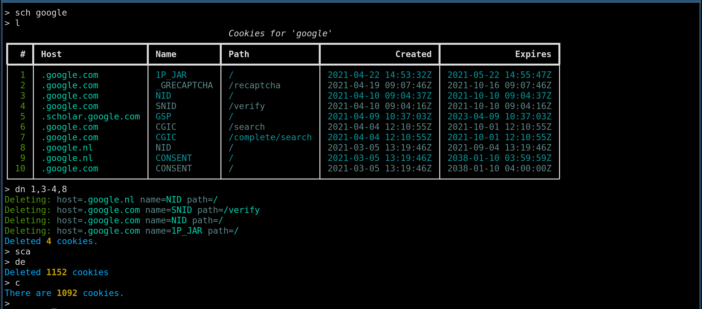

# Oatmeal

Oatmeal is a simple, console-based cookie management utility designed for
use with [Qutebrowser](https://github.com/qutebrowser/qutebrowser), which
is powered by QT WebEngine. I expect it will work with any Chromium-based
engine, however.

It is basically a dressed-up SQLite client that provides a streamlined
process to delete entries from a DB table. You could do all of this with
the standard `sqlite` CLI client; it would just take longer.




## Features

The primary use case for Oatmeal is to cleanse your cookie database after
a browsing session[1].

It allows for manual selection & deletion, but also supports a blacklist and
whitelist, which can provide a very fast workflow for cookie cleansing
operations.

> [1] As SQLite does not support concurrent write access, the browser
> process should _not_ be running when Oatmeal is running. This is why
> Oatmeal works best in a workflow where your browser is terminated after
> your browsing session is complete. It is less effective if you leave
> your browser process running for days/weeks, as there are fewer
> opportunities where Oatmeal can do its job.


## Requirements

Oatmeal requires Python 3.7 or later. As well, it requires a third-party
library called [Rich](https://github.com/willmcgugan/rich), which handles
all the pretty colours and tables. On most systems, you can install it
like so:

```
$ pip install --user rich
```


## Usage

Oatmeal is authored as a single python file, intended to be easy to pass
around in `~/bin` directories and dotfiles.

To start Oatmeal, simply run the script (`chmod +x` it, first) or run it
through Python explicitly:

```
$ python oatmeal.py
```

Oatmeal operates as a CLI interface. It provides a handful of very
tersely-named commands, intended to be fast and mnemonically-friendly (eg,
`sch` means "**s**elect **c**ookies by **h**ost").

#### Batch Commands

You can also run a sequence of commands directly from the shell, useful
for automation.

For example, to delete all expired cookies in the DB, run:

```
$ oatmeal.py -e 'sca; de'
```


### Operating on Data

Within the list of commands, you will find some **selection**
operations. These commands create the selection on which the other
commands will operate.

> There are three types of data that can be selected: cookies, whitelist
> entries, and blacklist entries. You can always see your current selection
> by running the `l` command. The title will show you what exactly you're
> looking at.

For example, if you select only cookies whose host matches `example.com`,
and then execute the **d**elete **a**ll (`da`) command, you will be
deleting _only_ the cookies matching `example.com`, since that was the
last selection made. The rest of your cookies would remain untouched.


### Command List

Commands use the fewest letters possible, while still trying to be
mnemonically-friendly. Some commands take a single argument, others have
none.

To see the usage details for a command, type `h <command>` at the prompt.

```
  Select
    sca       Select all cookies in DB.
    sch       Select all cookies matching host.
    sba       Select all entries in blacklist.
    sbh       Select all blacklist entries matching host.
    swa       Select all entries in whitelist.
    swh       Select all whitelist entries matching host.
  List
    l         List the current page of the selection.
    c         Count all entries in the selection.
    n         Next Page.
    p         Previous page.
  View
    v         View details for a cookie, referenced by number.
  Add
    ah        Add a host to the selection.
  Delete
    dn        Delete one or more entries by number.
    da        Delete all entries in selection.
    de        Delete expired cookies from the selection.
    db        Delete all selected cookies whose hosts are found in the blacklist.
  Other
    h         Provide usage documentation for commands.
    x         Exit without saving black/white lists.
    q         Save black/white lists and exit.
```


### Examples

#### Delete all expired cookies

First, we select all cookies in the DB. Then we ask Oatmeal to run through
this selection, removing any that have an expiration date in the past.

```
> sca
> de
Deleted 1138 cookies
```

#### Delete all Google cookies

We create a selection that contains only cookies with the string "google"
in the host field, then we list the contents. After seeing the contents,
we delete them all.

```
> sch google
> l
                                           Cookies for 'google'
┏━━━━┳━━━━━━━━━━━━━━━━━━━━━┳━━━━━━━━━━━━━┳━━━━━━━━━━━━━━━━━━┳━━━━━━━━━━━━━━━━━━━━━━┳━━━━━━━━━━━━━━━━━━━━━━┓
┃  # ┃ Host                ┃ Name        ┃ Path             ┃              Created ┃              Expires ┃
┡━━━━╇━━━━━━━━━━━━━━━━━━━━━╇━━━━━━━━━━━━━╇━━━━━━━━━━━━━━━━━━╇━━━━━━━━━━━━━━━━━━━━━━╇━━━━━━━━━━━━━━━━━━━━━━┩
│  1 │ .google.com         │ 1P_JAR      │ /                │ 2021-04-22 14:53:32Z │ 2021-05-22 14:55:47Z │
│  2 │ .google.com         │ _GRECAPTCHA │ /recaptcha       │ 2021-04-19 09:07:46Z │ 2021-10-16 09:07:46Z │
│  3 │ .google.com         │ NID         │ /                │ 2021-04-10 09:04:37Z │ 2021-10-10 09:04:37Z │
│  4 │ .google.com         │ SNID        │ /verify          │ 2021-04-10 09:04:16Z │ 2021-10-10 09:04:16Z │
│  5 │ .scholar.google.com │ GSP         │ /                │ 2021-04-09 10:37:03Z │ 2023-04-09 10:37:03Z │
│  6 │ .google.com         │ CGIC        │ /search          │ 2021-04-04 12:10:55Z │ 2021-10-01 12:10:55Z │
│  7 │ .google.com         │ CGIC        │ /complete/search │ 2021-04-04 12:10:55Z │ 2021-10-01 12:10:55Z │
│  8 │ .google.nl          │ NID         │ /                │ 2021-03-05 13:19:46Z │ 2021-09-04 13:19:46Z │
│  9 │ .google.nl          │ CONSENT     │ /                │ 2021-03-05 13:19:46Z │ 2038-01-10 03:59:59Z │
│ 10 │ .google.com         │ CONSENT     │ /                │ 2021-03-05 13:19:46Z │ 2038-01-10 04:00:00Z │
└────┴─────────────────────┴─────────────┴──────────────────┴──────────────────────┴──────────────────────┘
> da
Deleted 10 cookies
```

If a selection contains more rows than the height of the console (ie, it
would scroll), then Oatmeal will paginate the results, showing you only
the amount that will fit comfortably on the screen. You can navigate
between pages using the `n` and `p` commands.

#### Add some entries to the blacklist & whitelist

The `ah` command is used to add hosts to the lists. Just select all
entries for the list you're modifying, then add hosts to it. The list will
be saved to disk when you exit via ^D or `q`.

```
> sba
> ah .google.com
Added '.google.com' to blacklist.
> ah sleazytracker.com
Added '.sleazytracker.com' to blacklist.
> l
     Full Blacklist
┏━━━┳━━━━━━━━━━━━━━━━━━━━┓
┃ # ┃ Host               ┃
┡━━━╇━━━━━━━━━━━━━━━━━━━━┩
│ 1 │ .google.com        │
│ 2 │ .sleazytracker.com │
└───┴────────────────────┘

> swa
> ah scholar.google.com
Added '.scholar.google.com' to whitelist.
> l
      Full Whitelist
┏━━━┳━━━━━━━━━━━━━━━━━━━━━┓
┃ # ┃ Host                ┃
┡━━━╇━━━━━━━━━━━━━━━━━━━━━┩
│ 1 │ .scholar.google.com │
└───┴─────────────────────┘
```

#### Delete cookies found in the blacklist

Once we have entries in the lists, we can use them to scrub our cookie
database. First, create a selection of all cookies, then ask Oatmeal to
scrub it against the blacklist. The whitelist will take precedence, so any
entries found therein will not be removed.

```
> sca
> c
There are 2248 cookies.
> db
Cookie matches whitelist, ignoring: host=.scholar.google.com name=GSP path=/
Deleting: host=.google.com name=CONSENT path=/
Deleting: host=.google.com name=CGIC path=/complete/search
Deleting: host=.google.com name=CGIC path=/search
Deleting: host=.google.com name=SNID path=/verify
Deleting: host=.google.com name=NID path=/
Deleting: host=.google.com name=_GRECAPTCHA path=/recaptcha
Deleting: host=.google.com name=1P_JAR path=/
Deleted 7 cookies.
> c
There are 2241 cookies.
```

## My Workflow (aka The Reason I Built It)

### Qutebrowser

As a Qutebrowser user, I also use a third-party script that provides
a mechanism to run multiple QB profiles. It does this via some path-based
sleight-of-hand, but the result is a fairly smooth workflow, one that
allows me to containerize my web browsing. For example, I might have one
profile for social media, one for work, one for shopping, etc.

See the [QB multi-profile script](https://github.com/jtyers/qutebrowser-profile).

To integrate Oatmeal, I have modified my version of this script so that it
executes Oatmeal after QB terminates.

```
--- qutebrowser-profile 2021-04-26 12:08:26.240989575 -0400
+++ /home/jvinet/bin/qb 2021-05-02 12:33:23.127131380 -0400
@@ -147,7 +147,10 @@
     ln -fsT "$XDG_DATA_HOME/qutebrowser/profiles/$session" "$basedir/data"
   fi

-  $qutebrowser --set window.title_format "{perc}qute [${session}]{title_sep}{current_title}" "$@" &>/dev/null &
+  $qutebrowser --set window.title_format "{perc}qute [${session}]{title_sep}{current_title}" "$@" &>/dev/null
+
+  cd "$XDG_DATA_HOME/qutebrowser/profiles/$session/webengine"
+  alacritty -t qb-cookie-mgr -e ~/bin/oatmeal.py
 }
```

To start QB with a new/existing profile, I simply run the `~/bin/qb`
script, which pops up a rofi/dmenu window, allowing me to select the
profile I want. It then starts up QB.

After I exit QB, a new terminal window appears containing the Oatmeal
process, allowing me to do my post-shutdown cleansing routine.

Since Oatmeal is being executed from the `webengine` directory of the
active profile, it will also maintain black- and white- lists that are
specific to that profile (it will read from the CWD by default).


#### Alternative: Automation

Alternatively, if you have well-curated black/white- lists, you could
automate the cookie-cleansing by altering the oatmeal invocation to be:

```
oatmeal.py -e 'sca; de; db'
```

This will automatically remove any expired cookies, as well as any cookies
found in the blacklist.

If you are even more strict, you can delete all cookies who do not appear
in your whitelist. We can use the "**d**elete **a**ll" (`da`) command, as
it will respect the whitelist, and not remove those items.

```
oatmeal.py -e 'sca; de; da'
```


### Sway

In the QB script modification above, you'll note that I'm using the `-t`
switch with Alacritty (my terminal of choice). This allows me to override
the window title of the terminal window.

I do this so that I can apply a special window configuration from my Sway
configuration:

```
for_window [title="qb-cookie-mgr"] floating enable
```

This way, the Oatmeal window appears as a centered, floating one and not
a tiled one. This is a personal preference, but not required for this
workflow.


## License

Oatmeal is Copyright (C) 2021 Judd Vinet, and is licensed under the MIT
License.

